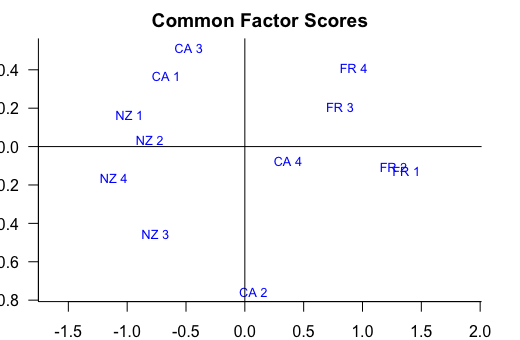
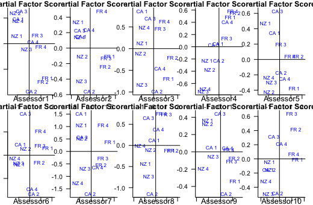
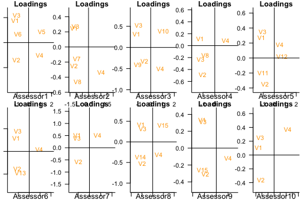
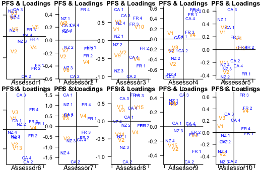
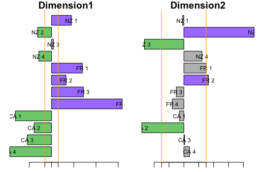
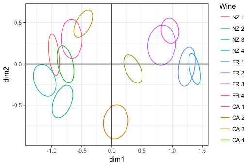

```{r, setup, include=FALSE}
library(knitr)
knitr::opts_chunk$set(size = 'footnotesize')
options(width=78)
```
# Task allocation

  Dan Shen: mfa function and presentation
  
  Letian Shi: related methods and function/mfa function
  
  Qianyi Yang: Shiny app
  
  Xin Wang: R packaging and bootstrap function
  
  Yue You: Generic methods and plotting graphs in bootstrap function

# MFA package introduction
This project is implemented in the form of an R package which provides R functions, user manuel, tests, as well as vignettes. This package is set up on github for collaboration and will be available for public use.

Function:

  * `mfa()`
  * `print() & plot()`
  * `LG()`
  * `bootstrap()`
  * And a set of related methods and functions: 
    - summaries of eigenvalues
    - contributions
    - $R_{V}$ coefficient
  
 

# What is MFA? - part 1
Multiple factor analysis aims to handle data set that measures sets of variables collected on the same observations. For example, the sets of variables could be the evaluation of a set of wines by a group of assessors. And each assessor will use four or more variables considered as standard for the evaluation.

- Step 0: Normalize Each Data Table (Preparing Data)
  
  For example, the data consists of K tables (one table for one assessor).
  
  First, each table is centered and normalized that in each column the mean is equal to 0 and the sum of the square values of all the elements is equal to 1. 

# What is MFA? - part 2

- Step 1: PCA of Each Data Table

  Each table is analyzed via a standard PCA. That is, each table is expressed via its SVD as:
  
  $X_{[k]}=U_{[k]}\Gamma_{[k]} V_{[k]}^{T}$ with $U_{[k]}^{T}U_{[k]}=V_{[k]}^{T}V_{[k]}=I$
  
  The weight of a table is obtained from the first singular value of its PCA. The weight, $\alpha_{k}$, is equal to the inverse of the first squared singular value:
  
  $$\alpha_{k}=\frac{1}{\gamma_{1,k}^2}$$
  Then a diagonal matrix A is obtained as:
  
  $$A=diag{[\alpha_{1}1_{[1]}^{T},...\alpha_{k}1_{[k]}^{T},...,\alpha_{K}1_{[K]}^{T}]}$$
 
# What is MFA? - part 3

- Step 2: GSVD of X

  Generate matrix M (masses for the observations);
  
  All the normalized data tables are aggregated into a grand data table X that is to be analyzed via GSVD. The GSVD is expressed as:
  
  $X=P\Delta Q^{T}$ with $P^{T}MP=Q^{T}AQ=I$.
  
  This analysis will provide factor scores to describe the observations and factor loadings to describe the variables. 
  
  $X=FQ^{T}$ with $F=P\Delta$
  
  where F stores the factor scores and Q stores the loadings. And Q can be expressed as:
  
  $$Q=[Q_{[1]}^{T}...Q_{[k]}^{T}...Q_{[K]}^{T}]^{T}$$
  
# Main function: mfa - part 1
We provide a main function `mfa()` in our package:
    
  `mfa(data, sets, ncomps=NULL, center=TRUE, scale=TRUE)` where the arguments are:
  
- data: data set (matrix or data frame)
- sets: list of character or numeric vectors indicating the sets of variables 
- ncomps: integer indicating how many factors are to be extracted
- center: either a logical value or a numeric vector determining how column centering is perfromed
- scale: either a logical value or a numeric vector determining how the scaling of active variables is performed (after centering)

# Main function: mfa - part 2
`mfa()` function should return on object of class *"mfa"* with the following elements:

- eigen: vector containing the eigenvalues 
- common_factor_scores: matrix of common factor scores
- partial_factor_scores: matrix of partial factor scores
- loadings: matrix of loadings
    
We also provide other information such as alpha, `mass=rep(1/nrow,nrow)`,     `dim=min(ncomps,length(eigen))` and the complete scaled matrix for the user.

# Generic Methods - print and plot
`print()` method: displays 3 tables of basic information:

+ Table 1: Singular Values and Eigen Values;
+ Table 2. First Two Dimensions of Common Factor Scores;
+ Table 3. Partial Factor Scores of Any Assessor.

`plot()` method: displays 4 graphs with users' choice of any two dimenstions:

+ Graph 1: Common Factor Scores;
+ Graph 2: Partial Factor Scores;
+ Graph 3: Loadings rescaled to variance = eigen values;
+ Graph 4: Partial Factor Scores & rescaled Loadings together.

# Plot example - part 1


# Plot example - part 2


# Plot example - part 3


# Plot example - part 4


# Other functions - part 1
`summary_eigen(x)`function: returns a data frame including 5 kinds of components about eigenvalues.

Input:

- x: a MFA object

Output is a data frame including:

- singular value:the square root of eigenvalue
- eigenvalue: one of the properties contained in the mfa project
- cumulative1: the cumlulative of the eigenvalues in decreasing series
- Inertia: the proportion of each eigenvalue to the sum of all eigenvalues
- cumulative2: the cumlulative of the intertia in decreasing series

# Other functions - part 2

`contribution(x,type)`function: returns a data frame including the proportion of contributions of important elements.

Input:

- x: a MFA object
- type: a character-"observation","variaable" or "table" representing the kind of elements

Output is a data frame including:

- contribution of one kind of elements to a dimension seperately

# Other functions - part 3


`RV(table1,table2)`function: returns a number which is a coefficient to study the between-table structure.

Input:

- table1: a matrix
- table2: a matrix which has the same number of rows as table1

`RV_table(dataset,sets)`function: returns a data frame and the components are the coefficient about the tables.

Input:

- dataset: a data frame
- sets: a list of vectors representing different tables

# Other functions - part 4

`LG(table1,table2)`function: returns a number which is a coefficient to study the between-table structure.
 LG function is another way to analyze between-table structure besides RV.

Input:

- table1: a matrix
- table2: a matrix which has the same number of rows as table1

# Bootstrap 
`Bootstrap.mfa(X, L)` method: computes the bootstrapped eatimate of the factor scores as well as the bootstrap ratio. The input parameters are:

- X: a MFA object
- L: the bootstrap sample size

The output information contains:

- All the bootstrapped factore scores
- Bootstrap ratio

Graphs:

- Graph 1: Bootstrap ratio plot for Components 1 and 2.
- Graph 2: Bootstrap confidence ellipses plotted on Components 1 and 2.

# Bootstrap - Graph 1


# Bootstrap - Graph 2
 
 
# Shiny App - part 1
We develop a shiny app that provides an interactive visualizeation for the results from MFA. We provide
the user with six types of plots, and the user can select which plot to look at.

  - *a bar-chart of the eigenvalues* 
  - *a scatterplot of the common factor scores* 
  - *a scatter plot of the partial factor scores* 
  - *a scatter plot of the partial factor scores and the loadings* 
  - *a bar-chart of bootstrap ratios*
  - *a bootstrap confidence ellipses plot*

For the two scatter plots related to partial factor scores and loadings, the user can choose which two dimensions to plot by adjusting the slider bar, and the plots will update automatically.

# Shiny App - part 2


